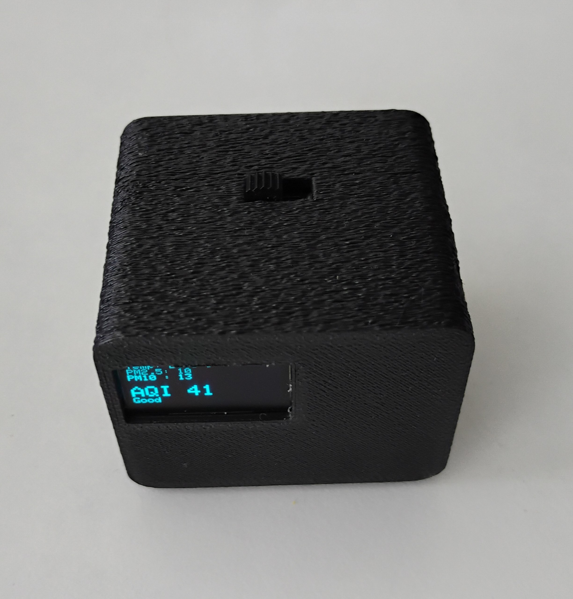
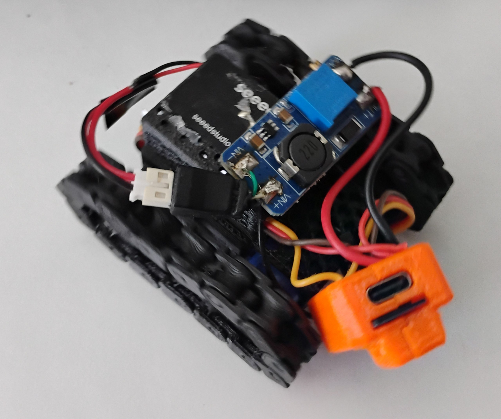
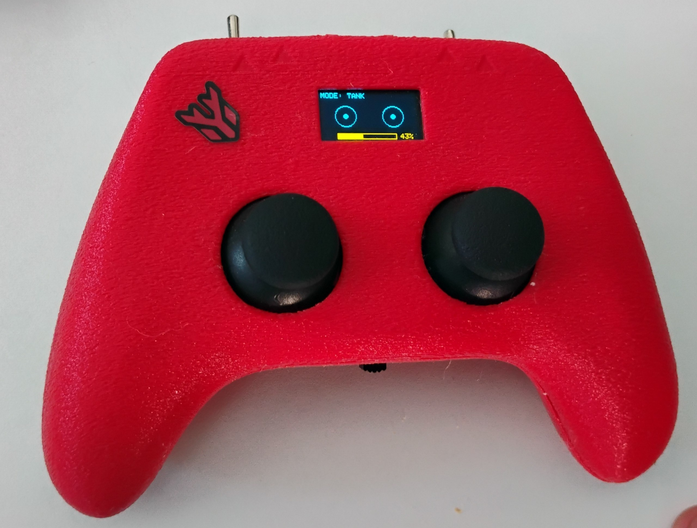

---
# try also 'default' to start simple
theme: seriph
# random image from a curated Unsplash collection by Anthony
# like them? see https://unsplash.com/collections/94734566/slidev
background: https://cover.sli.dev
# some information about your slides (markdown enabled)
title: Welcome to Slidev
info: |
  ## Slidev Starter Template
  Presentation slides for developers.

  Learn more at [Sli.dev](https://sli.dev)
# apply UnoCSS classes to the current slide
class: text-center
# https://sli.dev/features/drawing
drawings:
  persist: false
# slide transition: https://sli.dev/guide/animations.html#slide-transitions
transition: slide-left
# enable MDC Syntax: https://sli.dev/features/mdc
mdc: true
# duration of the presentation
duration: 35min
---
<!---->
# Student Projects

Stuff we've tinkered with

  Press Space for next page <carbon:arrow-right />

  <button @click="$slidev.nav.openInEditor()" title="Open in Editor" class="slidev-icon-btn">
    <carbon:edit />
  </button>
  <a href="https://github.com/slidevjs/slidev" target="_blank" class="slidev-icon-btn">
    <carbon:logo-github />
  </a>

<!--
The last comment block of each slide will be treated as slide notes. It will be visible and editable in Presenter Mode along with the slide. [Read more in the docs](https://sli.dev/guide/syntax.html#notes)
-->

---
layout: 'two-cols-header'
---

# AQI Monitor (Harshith)

::right::
Powered by an: 
- esp8266
- Battery
- Battery Management System + Charging
- Temperature Reading

::left::

---
layout: 'two-cols-header'
---

# Tank thing (Harshith)

::right::
Powered by an: 
- esp8266
- Battery
- Battery Management System + Charging
- Temperature Reading

::left::

---
layout: 'two-cols-header'
---

# Controller thing (Harshith)

::right::
Powered by an: 
- esp8266
- Battery
- Battery Management System + Charging
- Temperature Reading

::left::

--- 
layout: 'two-cols-header'
---

# Sidekick (sounddrill31/Souhrud)

::right::

    
    <a href="https://meetsidekick.tech" class="mt-4 font-mono text-sm opacity-70 hover:opacity-100">
      meetsidekick.tech
    </a>

::left::
(Stuck in R&D hell then burnout)

Stuff in here:
- PCBCupid's ESP32C3 board
- ADXL345
- I2C OLED
- LionCircuits' PCB
- Buzzer

I need ideas, and feedback!

--- 

# Xonotic India (sounddrill31/Souhrud)

(Not hardware, but definitely Open Source!)

Trying to grow the community xD

    
    <a href="https://india.xonotic.au" class="mt-4 font-mono text-sm opacity-70 hover:opacity-100">
      india.xonotic.au
    </a>
  

